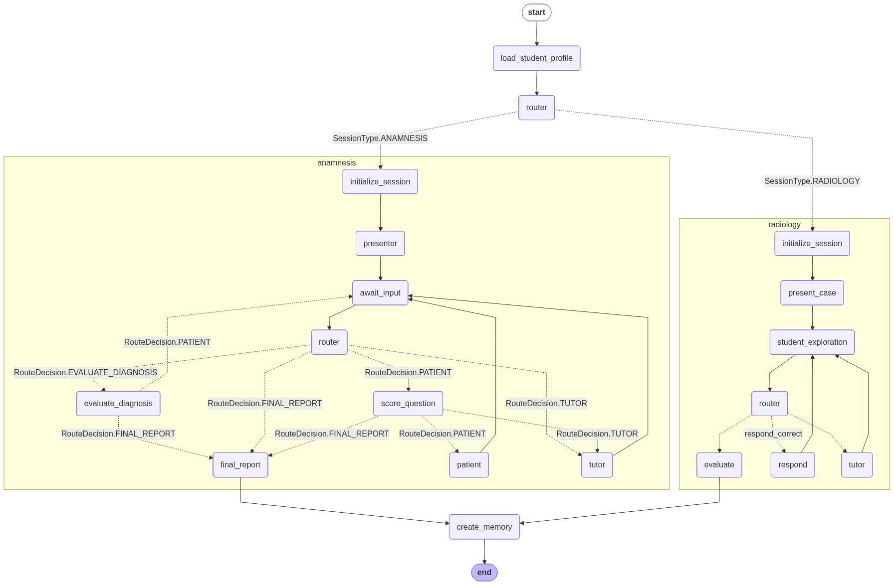

# SI Project — Backend

## Setup

1. Create a conda environment with Python 3.12 and install dependencies:

```sh
conda create -n si-proj python=3.12
conda activate si-proj
pip install -r requirements.txt
```

or

```sh
conda env create -f env.yml
conda activate si-proj
# to update env
conda env update -f env.yml --prune
```

2. Run a model locally on your machine (e.g. via [Ollama](https://ollama.com/), vLLM, etc.) and configure the connection in `llm/provider.py` accordingly — set the provider, model name, and base URL to match your local setup.

3. Start the development server:

```sh
fastapi dev --port 8008
```

## API

- `POST /chat` — Send a message to the study session. Body: `{"thread_id": "...", "message": "...", "student_id": "..."}`.

Use `requests.http` (VSCode REST Client) to test the endpoints.

## Scripts

### Seed users

Creates demo users (one `teacher`, one `student`) so you can sign in immediately without going through the signup flow.

```sh
conda activate si-proj
cd backend
python -m scripts.seed_users                  # idempotent — safe to re-run
python -m scripts.seed_users --reset-password # overwrite the password of existing seeded users
```

Default credentials (see `scripts/seed_users.py` to customize the `DEFAULT_USERS` list):

| Role    | Email                 | Password      |
| ------- | --------------------- | ------------- |
| teacher | `professor@email.com` | `password123` |
| student | `estudante@email.com` | `password123` |

Behaviour:

- Looks up each user by email and upserts. If the user exists with a different role, the role is updated in place.
- The password is only rewritten when `--reset-password` is passed (useful after forgetting the demo password).
- Requires the database to be reachable via `DATABASE_URL` from `.env`.

## File Structure

```
backend/
  main.py                  # FastAPI app and /chat endpoint
  llm/
    provider.py            # LLM provider configuration (Ollama, vLLM, etc.)
  graph/
    graph.py               # Orchestrator graph (routes to anamnesis or radiology)
    anamnesis.py           # Anamnesis subgraph (interactive patient interview)
  agents/
    patient.py             # Patient agent (responds in-character to student questions)
  prompts/
    patient.py             # Patient system prompt
    tutor.py               # Tutor system prompt (guidance on irrelevant questions)
    evaluator.py           # Evaluator system prompt (session summary)
  state/
    anamnesis.py           # Anamnesis session state schema
  requests.http            # REST Client file for testing endpoints
  generate_graph_diagram.py  # Dev script to generate the graph diagram below
```

## Graph



## Anamnesis case extraction & model context

The case extractor (`POST /anamnesis-cases`) sends each clinical document to
the medical model in chunks. The server's context window (`n_ctx`) must be
at least 4096; 8192+ is recommended for fewer chunks and better single-shot
extractions.

With llama.cpp or LM Studio, start the model with `--ctx-size 8192` (or
larger). You can also tune the per-call cap with
`RAG_EXTRACT_MAX_CHARS` (default 10000) in `.env` — lower it if the server
runs with a smaller context, raise it if the server runs with a larger one.

If a document still overflows, the API returns `400` with
`detail: "Document too long for the configured model context (n_ctx)…"`,
which the teacher sees in the upload / re-extract banner.
